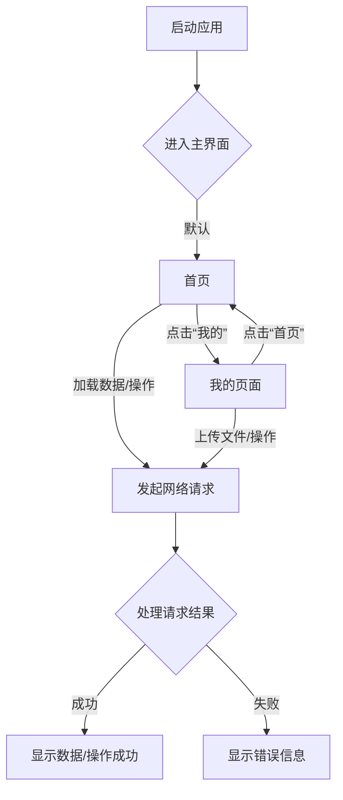

## 1. 产品概述
这是一个旨在提供移动应用核心功能的项目，包括内容展示和个人管理。
- 解决用户日常信息浏览和个人设置管理的需求。
- 目标用户是移动应用用户。
- 旨在提供一个稳定、高效、易用的移动应用基础框架。

## 2. 核心功能

### 2.1 用户角色
| 角色 | 注册方式 | 核心权限 |
|------|---------------------|------------------|
| 普通用户 | 邮箱/手机注册 | 浏览内容，管理个人设置 |

### 2.2 功能模块
1.  **首页 (Home)**: 展示核心内容，如文章列表、推荐等。
2.  **我的 (Mine)**: 用户个人信息、设置、功能入口等。

### 2.3 页面详情
| 页面名称 | 模块名称 | 功能描述 |
|-----------|-------------|---------------------|
| 首页 (Home) | 内容展示区 | 动态加载各类内容，支持下拉刷新和上拉加载更多 |
| 首页 (Home) | 导航栏 | 顶部或底部导航，方便用户切换功能 |
| 我的 (Mine) | 个人信息区 | 展示用户头像、昵称、ID等，支持编辑 |
| 我的 (Mine) | 设置列表 | 包含隐私设置、通知设置、关于我们等入口 |
| 我的 (Mine) | 其他功能入口 | 例如：我的收藏、意见反馈等 |

## 3. 核心流程

### 3.1 用户使用流程
1.  用户启动应用，进入“首页”。
2.  在“首页”浏览内容。
3.  点击底部导航栏切换至“我的”页面。
4.  在“我的”页面查看个人信息或进行设置。
5.  在任一页面进行网络请求（如加载数据、上传文件）。

## 4. 用户界面设计
### 4.1 设计风格
-   **主色调与辅助色**: 采用现代、清新的配色方案，主色调为品牌色，辅以中性色和强调色。
-   **按钮样式**: 简洁的圆角按钮，扁平化设计，注重可用性。
-   **字体和大小**: 选用易读性高的无衬线字体，如思源黑体，字体大小层级分明，提升阅读体验。
-   **布局风格**: 采用卡片式布局结合列表，内容区分清晰，顶部导航。
-   **图标/表情符号建议**: 扁平化、线性风格图标。

### 4.2 页面设计概览
| 页面名称 | 模块名称 | UI 元素 |
|-----------|-------------|-------------|
| 首页 (Home) | 内容展示区 | 瀑布流/列表布局，图片、文字、时间等元素，下拉刷新动画 |
| 我的 (Mine) | 个人信息区 | 圆形头像、用户昵称、个性签名、背景图 |
| 我的 (Mine) | 设置列表 | 带有图标和文字的列表项，右侧箭头指示可点击 |

### 4.3 响应性
-   **移动优先，自适应设计**: 界面元素和布局能够根据不同移动设备的屏幕尺寸进行自适应调整，确保在各种设备上均有良好的用户体验。
-   **触控优化**: 针对触控操作进行优化，如按钮和可点击区域的大小，手势操作的流畅性。
