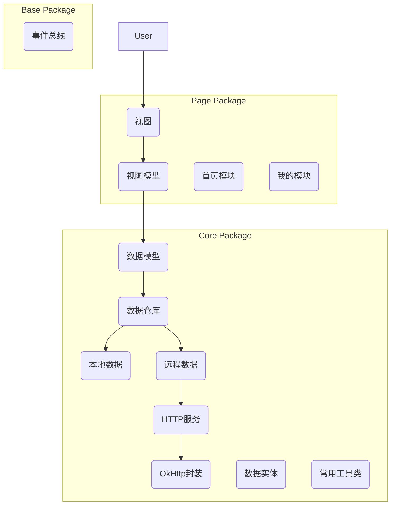
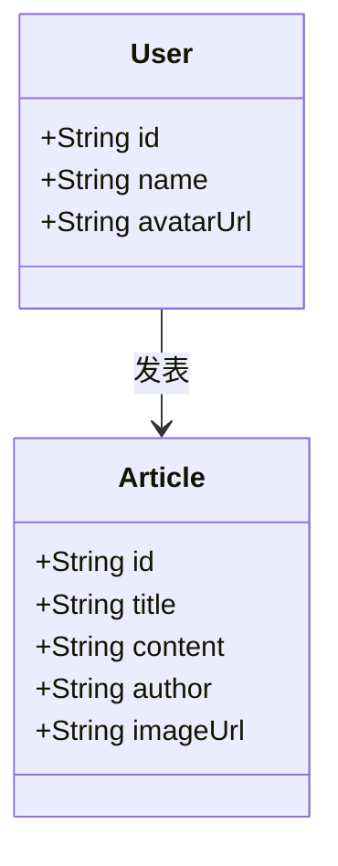

## 1. 架构设计

## 2. 技术说明
-   **开发平台**: Android
-   **主要语言**: Kotlin/Java
-   **构建工具**: Gradle
-   **网络库**: OkHttp (用于HTTP请求，包括文件上传)
-   **图片加载**: Glide (推荐，常用工具类)
-   **依赖注入**: Hilt/Koin (推荐，常用工具类)
-   **事件总线**: GreenRobot EventBus (或类似实现)
-   **架构模式**: MVVM (Model-View-ViewModel)
-   **常用工具类**: `LogUtils`, `ToastUtils`, `StringUtils`, `DateUtils`, `FileUtils`等。
-   **代理仓库配置**: 
    -   `google()`
    -   `mavenCentral()`
    -   `jcenter()` (已废弃，但仍可能存在于旧项目中)
    -   `maven { url 'https://jitpack.io' }`
    -   `maven { url 'https://developer.huawei.com/repo/' }`

## 3. 路由定义
| 路由 | 用途 |
|-------|---------|
| `/home` | 首页，展示应用核心内容 |
| `/mine` | 我的页面，管理个人信息和设置 |

## 4. API 定义
### 4.1 HTTP服务封装
-   **Get请求**: `fun get(url: String, params: Map<String, String>): Call`
-   **Post请求**: `fun post(url: String, params: Map<String, String>): Call`
-   **单文件上传**: `fun uploadFile(url: String, file: File, fileParamName: String, params: Map<String, String>): Call`
-   **多文件批量上传**: `fun uploadMultipleFiles(url: String, files: Map<String, File>, params: Map<String, String>): Call`

### 4.2 数据实体 (Bean)
-   `core` 包下将新建 `bean` 子包，用于存放所有网络请求和本地数据相关的 Java/Kotlin 数据实体类。

## 5. 服务器架构图
(当前项目为客户端应用，不涉及服务器架构图)

## 6. 数据模型
### 6.1 数据模型定义

### 6.2 数据定义语言
(当前项目为客户端应用，不涉及数据库DDL)
